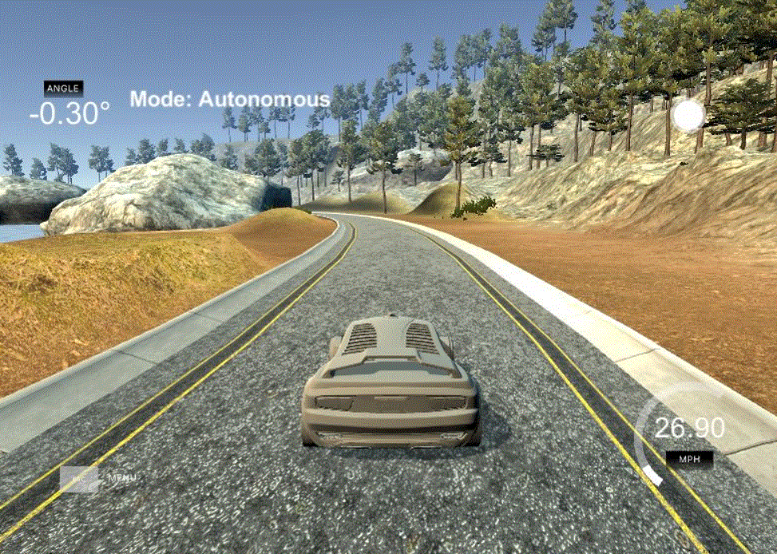
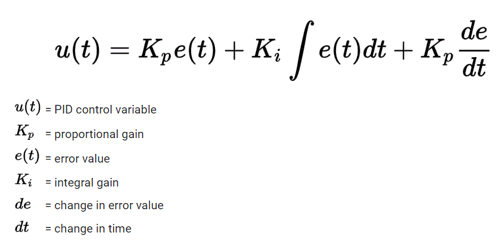
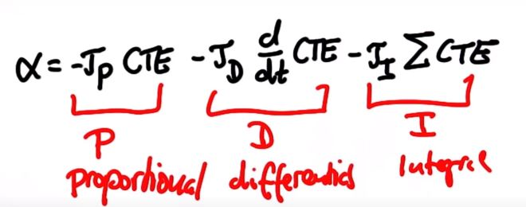
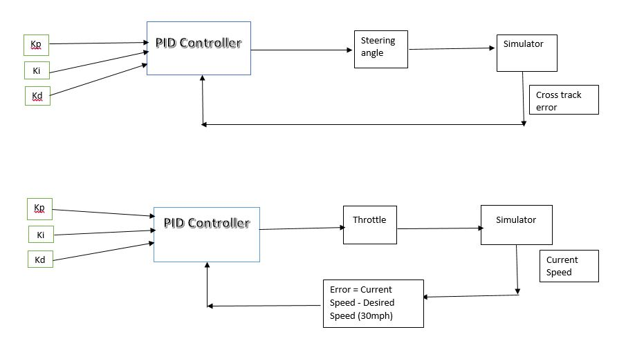

# CarND-Controls-PID
Self-Driving Car Engineer Nanodegree Program

---

## Dependencies

* cmake >= 3.5
 * All OSes: [click here for installation instructions](https://cmake.org/install/)
* make >= 4.1(mac, linux), 3.81(Windows)
  * Linux: make is installed by default on most Linux distros
  * Mac: [install Xcode command line tools to get make](https://developer.apple.com/xcode/features/)
  * Windows: [Click here for installation instructions](http://gnuwin32.sourceforge.net/packages/make.htm)
* gcc/g++ >= 5.4
  * Linux: gcc / g++ is installed by default on most Linux distros
  * Mac: same deal as make - [install Xcode command line tools]((https://developer.apple.com/xcode/features/)
  * Windows: recommend using [MinGW](http://www.mingw.org/)
* [uWebSockets](https://github.com/uWebSockets/uWebSockets)
  * Run either `./install-mac.sh` or `./install-ubuntu.sh`.
  * If you install from source, checkout to commit `e94b6e1`, i.e.
    ```
    git clone https://github.com/uWebSockets/uWebSockets 
    cd uWebSockets
    git checkout e94b6e1
    ```
    Some function signatures have changed in v0.14.x. See [this PR](https://github.com/udacity/CarND-MPC-Project/pull/3) for more details.
* Simulator. You can download these from the [project intro page](https://github.com/udacity/self-driving-car-sim/releases) in the classroom.

Fellow students have put together a guide to Windows set-up for the project [here](https://s3-us-west-1.amazonaws.com/udacity-selfdrivingcar/files/Kidnapped_Vehicle_Windows_Setup.pdf) if the environment you have set up for the Sensor Fusion projects does not work for this project. There's also an experimental patch for windows in this [PR](https://github.com/udacity/CarND-PID-Control-Project/pull/3).

## Basic Build Instructions

1. Clone this repo.
2. Make a build directory: `mkdir build && cd build`
3. Compile: `cmake .. && make`
4. Run it: `./pid`. 

Tips for setting up your environment can be found [here](https://classroom.udacity.com/nanodegrees/nd013/parts/40f38239-66b6-46ec-ae68-03afd8a601c8/modules/0949fca6-b379-42af-a919-ee50aa304e6a/lessons/f758c44c-5e40-4e01-93b5-1a82aa4e044f/concepts/23d376c7-0195-4276-bdf0-e02f1f3c665d)

## Editor Settings

We've purposefully kept editor configuration files out of this repo in order to
keep it as simple and environment agnostic as possible. However, we recommend
using the following settings:

* indent using spaces
* set tab width to 2 spaces (keeps the matrices in source code aligned)

## Code Style

Please (do your best to) stick to [Google's C++ style guide](https://google.github.io/styleguide/cppguide.html).

## Project Instructions and Rubric

Note: regardless of the changes you make, your project must be buildable using
cmake and make!

More information is only accessible by people who are already enrolled in Term 2
of CarND. If you are enrolled, see [the project page](https://classroom.udacity.com/nanodegrees/nd013/parts/40f38239-66b6-46ec-ae68-03afd8a601c8/modules/f1820894-8322-4bb3-81aa-b26b3c6dcbaf/lessons/e8235395-22dd-4b87-88e0-d108c5e5bbf4/concepts/6a4d8d42-6a04-4aa6-b284-1697c0fd6562)
for instructions and the project rubric.

## Reflections

The project focuses on designing a PID controller and tune the PID hyperparameters for the autonomous vehicle to drive through the simulated environment. The simulator provides cross-track error (CTE), speed, and steering angle data via a local Websocket. The PID controller must respond with steering and throttle commands to drive around the simulator road.





## PID Controller 

### Proportional Controller

The proportional component is useful for finding out the sudden change in error and act accordingly. The error function we use here is the Cross-track error, which is the difference between the vehicle location and the lane's center. The proportional controller adjusts the steering value with the constant Kp multiplied with the cross-track error. This enables the vehicle to track errors fast and act faster.

The main drawback of this P controller is that the vehicle overshoots the desired position and then returns to it by adjusting the steering angle in the opposite direction based on the error. But this overshoot drives our vehicle to oscillations as the car crosses the center lane each time and while coming back to center, it again overshoots and causes oscillation.

### Proportional Derivative Controller 
To solve this oscillation around the steady-state, we add a derivative component. The derivate component takes the difference between the previous cross-track error and the present cross-track error divided by time and multiplied by constant Kd. This causes the error to be steady-state without any overshoot, thus eliminating the oscillations around the steady-state. Based on the difference between the previous and current CTE values, it reduces the steering angle given by the P controller. When a current error is less than the previous error, it counters steers to avoid the oscillations around the steady-state.

The main drawback of the PD controller is that it is highly vulnerable to noise. Previously, we assumed that the wheels are perfectly aligned with the 0 degrees, but whenever there is a systematic bias, the wheel may not be 100% aligned with 0 degrees but may have some offset as below.


### Proportional Integral Controller 
It can be used as an Integral controller to solve systematic bias because the integral controller always brings the steady-state to 0 irrespective of any noise. The integral controller computes the sum of the previous CTE error and multiplies it by a constant Ki. Whenever it finds that the error remains higher (when PD didn't converge) based on the Ki value, it applies a steering action to eliminate the error and bring the car closer to the lane's center even though there is a systematic bias.

The only drawback of having the Integral element is that it always tries to bring the error to 0, practically impossible. The error can only bring the error down to a lower value. The Integral element still steers even when the error is lower, and that causes overshoot, leading to oscillations. These oscillations are amplified when the speed is higher and the car is thrown out of track. Thus to solve this, we always keep a fairly lower value for Ki.

The Integral element is modified to take the previous 50 CTE error alone to detect the current steering angle. This allowed faster response when the PD didn't converge, and we have sharp corners.


<h2>PID Equation </h2>





<h2>System architecture </h2>

<p> We use a separate controller to control the steering angle and a separate controller for controlling the throttle. The steering angle controller uses CTE as the error metric, while the throttle controller uses Current Speed -  desired speed (30mph) as the error metric.</p>




<p> The Tuning of the Kp, Ki, and Kd values is done manually based on the above definition. The values are given in the below table.</p>

<h3> Steering angle Controller </h3>

| Kp | Ki | Kd |
|  :---: |     :---:      |    :---:      |
| 0.09   | 0.000001     | 4.7           |


## Results

A video of the car driving autonomously around the track in the simulator (click to see the full video)

https://youtu.be/SR42jbhC1PY
